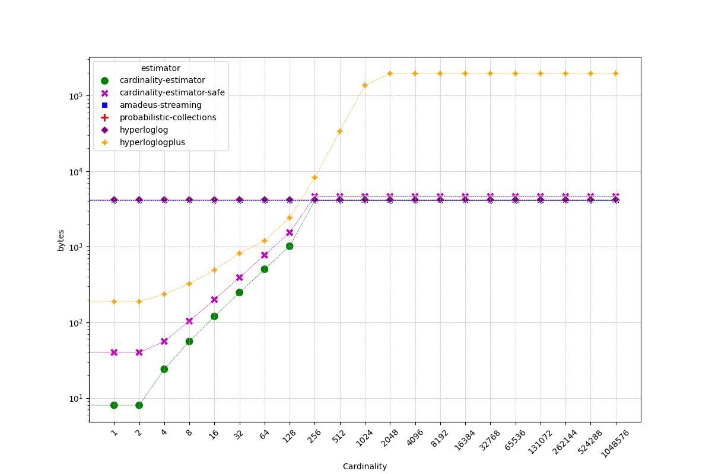
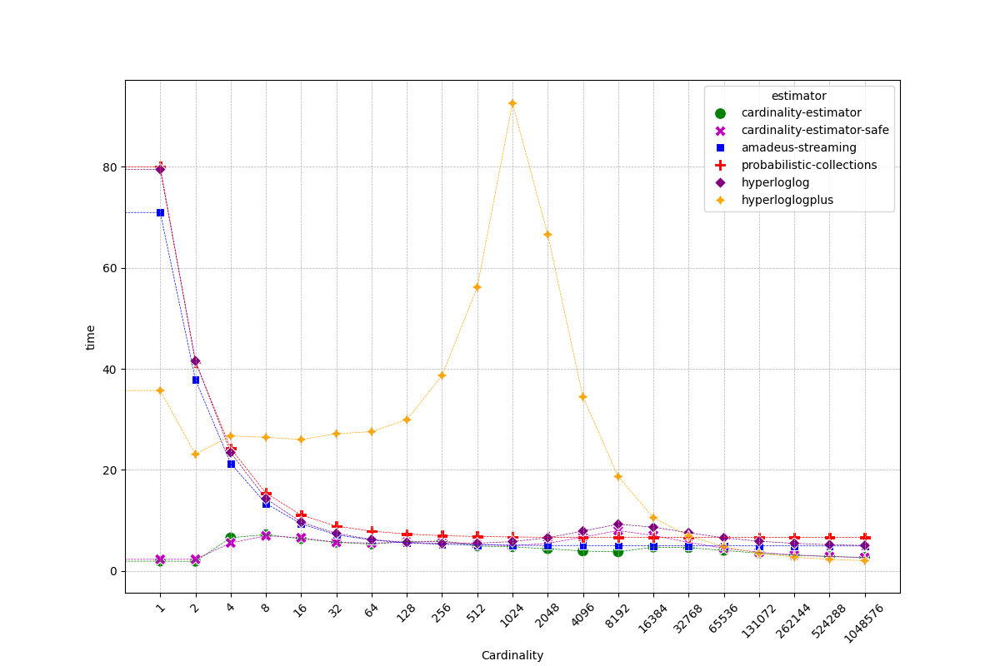
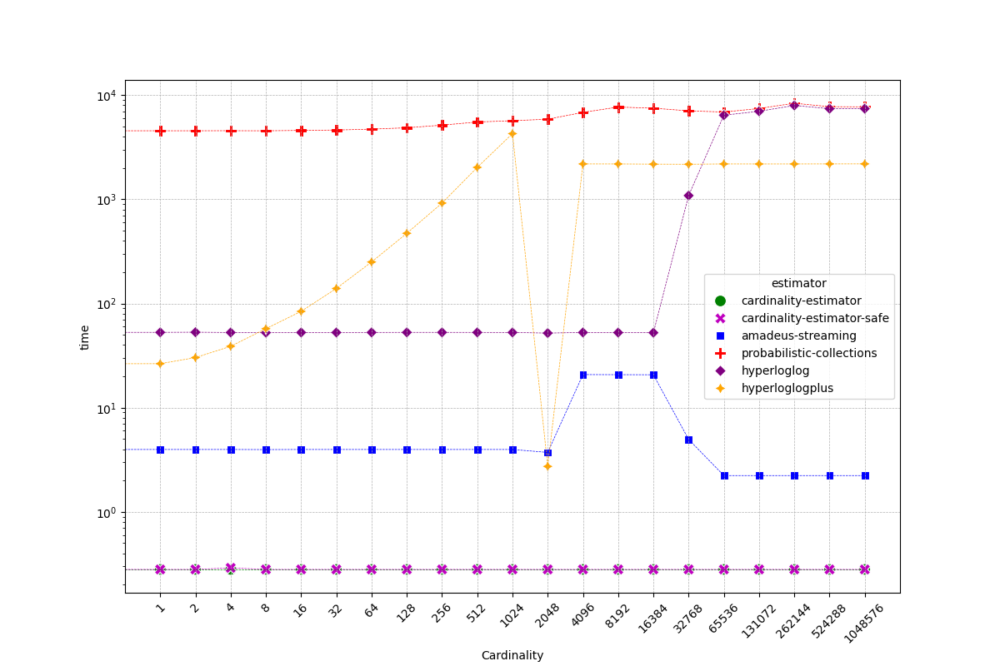
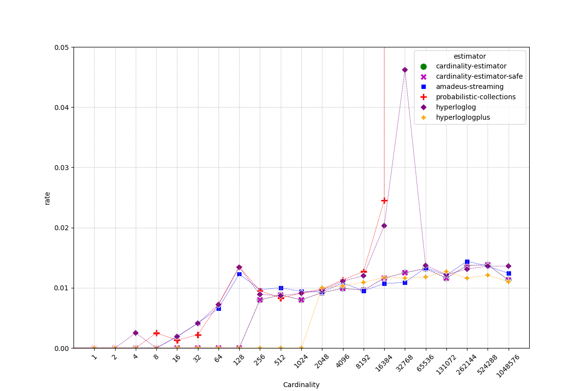

# cardinality-estimator-safe


[](https://docs.rs/cardinality-estimator-safe)
[](https://crates.io/crates/cardinality-estimator-safe)
[](LICENSE)

`cardinality-estimator-safe` began as a fork of Cloudflare's `cardinality-estimator`, replacing its unsafe data representations with boring old owned standard types, to eliminate all uses of `unsafe`. Its serialization formats are intended to be reasonable with `serde_json`, and efficient with `bincode`.

`cardinality-estimator-safe` estimates the number of distinct elements in a stream or dataset, with low memory usage, low latency, and high accuracy.
This is achieved by leveraging a combination of unique data structure design, efficient algorithms, and HyperLogLog++ for high cardinality ranges.


### Compared to other crates

- `cardinality-estimator` is [currently](https://github.com/cloudflare/cardinality-estimator/pull/12) vulnerable to memory safety violations due to its `unsafe` handling of arrays when deserializing.
- `amadeus-streaming` writes out a huge array when serializing small cardinalities. it contains unsafe code without much documentation to justify it, though that code can be avoided by avoiding the SIMD paths.
- `hyperloglogplus` serialization is not compact, writing out even phantom data when serializing.

`cardinality-estimator-safe` serializes to a fairly compact representation with `serde_json`, and is designed to be especially compact with binary encoders like `bincode` and `postcard`. you can see samples with `cargo run --features with_serde --example json`.

`cardinality-estimator-safe` moves hashing to an `Element` wrapper that you can `.insert` to a sketch. This API is more verbose, but offers a few advantages:

- Easy to adapt for use with any hasher. The `with_digest` feature enables use with [any hasher from rust-crypto](https://github.com/RustCrypto/hashes), and enables the `from_digest_with_prefix` constructor for salting data where metrics might be exposed publicly and gamed.
- `Sketch`es can be serialized, deserialized, estimated, and merged, without any coupling to the hashing configuration.


### Crate status

- **all unsafe code has been eliminated**, but there are still many potential panics in the code.
- fuzzing harnesses are improved from `cardinality-estimator`, and excersized to try to discover any paths to a panic.
- serialization and deserialization have been completely rewritten.
- deserialization performance for hyperloglog representations is currently less than optimal, but there are easy ways to make it fast.
- some of the code could definitely be refactored for further clarity.


## Getting Started

To use `cardinality-estimator-safe`, add it to your `Cargo.toml` under `[dependencies]`:

```toml
[dependencies]
cardinality-estimator-safe = "4.0.0"
```

Then, import `cardinality-estimator-safe` in your Rust program:

```rust
use cardinality_estimator_safe::{Sketch, Element};
use wyhash::WyHash;

let mut estimator = Sketch::<12, 6>::default();
estimator.insert(Element::from_hasher_default::<WyHash>("test"));
let estimate = estimator.estimate();

println!("estimate = {}", estimate);
```

Note that you **must** use the same hasher configuration for all elements added to a sketch!

See more in [examples](examples).


### How to choose an `Element` initializer

At the core of HyperLogLog is a sort of "proof of work" algorithm: as elements are added to the sketch, it tracks the highest number of leading zeros seen in a hashed element bit pattern (and it does this across many bucketed groups of elements). As you observe more new element hashes, you eventually see "rarer" patterns, and it turns out that you can make pretty accurate cardinality estimates based on this tracked rarity!

In many cases, just pushing elements through a fast hasher works well! The example code above uses a very fast hasher called `WyHash`, which is what the original Cloudflare implementation used by default. 

There is one potential weakness though: if someone can influence any elements submitted to your sketch, they could try to find out the specific rare elements needed to artificailly inflate your estimate -- the elements that happen to hash to long leading zeros.

**If you just want it to work**: use the stdlib hasher

```rust
use cardinality_estimator_safe::{Sketch, Element};
use std::hash::DefaultHasher;

sketch.insert(Element::from_hasher_default::<DefaultHasher>(&thing));
```

- no extra dependencies, pretty fast
- **unspecified hash algorithm**, so a future rust release may yield different results and incompatible sketches. if you're not **storing** the sketches, that's probably ok!

**Maximum performance**: WyHash

```rust
use cardinality_estimator_safe::{Sketch, Element};
use wyhash::WyHash;

sketch.insert(Element::from_hasher_default::<WyHash>(&thing));
```

- very fast
- saved sketches will remain compatible (can be merged or inserted)

**Resistant to crafted inputs**: Cryptographic hash + secret prefix

- enable the `with_digest` feature to use [hashes from rust-crypto](https://github.com/RustCrypto/hashes)

```rust
use cardinality_estimator_safe::{Sketch, Element};
use sha2::Sha256;

sketch.insert(Element::from_digest_with_prefix::<Sha256>(
  YOUR_SECRET_SALT,
  &thing,
));
```

- resistant to offline attacks that would inflate estimates with crafted inputs
- saved sketches will remain compatible as long as the secret/salt is never updated
- rotating the secret invalidates future inserts and merges to existing sketches


## Low memory footprint

The `cardinality-estimator` achieves low memory footprint by leveraging an efficient data storage format.
The data is stored in three different representations - `Small`, `Array`, and `HyperLogLog` - depending on the cardinality range.
For instance, for a cardinality of 0 to 2, only **8 bytes** of stack memory and 0 bytes of heap memory are used.


## Low latency

The crate offers low latency by using auto-vectorization for slice operations via compiler hints to use SIMD instructions.
The number of zero registers and registers' harmonic sum are stored and updated dynamically as more data is inserted, resulting in fast estimate operations.


## High accuracy

The cardinality-estimator-safe achieves high accuracy by using precise counting for small cardinality ranges and HyperLogLog++ with LogLog-Beta bias correction for larger ranges.
This provides expected error rates as low as 0.02% for large cardinalities.


## Benchmarks

Benchmarks are added to directly compare Cloudflare's `cardinality-estimator` with `cardinality-estimator-safe`. They are included beside Cloudflare's original benchmarks for context.

To run benchmarks you first need to install `cargo-criterion` binary:

```shell
cargo install cargo-criterion
```

Then benchmarks with output format JSON to save results for further analysis:

```shell
make bench
```

We've benchmarked cardinality-estimator against several other crates in the ecosystem:
* [cardinality-estimator](https://crates.io/crates/cardinality-estimator)
* [hyperloglog](https://crates.io/crates/hyperloglog)
* [hyperloglogplus](https://crates.io/crates/hyperloglogplus)
* [amadeus-streaming](https://crates.io/crates/amadeus-streaming)
* [probabilistic-collections](https://crates.io/crates/probabilistic-collections)

Please note, that [hyperloglog](https://github.com/jedisct1/rust-hyperloglog/blob/1.0.2/src/lib.rs#L33) and [probabilistic-collections](https://gitlab.com/jeffrey-xiao/probabilistic-collections-rs/-/blob/da2a331e9679e4686bdcc772c369b639b9c33dee/src/hyperloglog.rs#L103) crates have bug in calculation of precision `p` based on provided `probability`:
* incorrect formula: `p = (1.04 / error_probability).powi(2).ln().ceil() as usize;`
* corrected formula: `p = (1.04 / error_probability).powi(2).log2().ceil() as usize;`

We're continuously working to make `cardinality-estimator` the fastest, lightest, and most accurate tool for cardinality estimation in Rust.

Benchmarks presented below are executed on Linux laptop with `13th Gen Intel(R) Core(TM) i7-13800H` processor and compiler flags set to `RUSTFLAGS=-C target-cpu=native`.


### Memory usage



Table below compares memory usage of different cardinality estimators.
The number in each cell represents `stack memory bytes / heap memory bytes / heap memory blocks` at each measured cardinality.

`cardinality-estimator-safe` has a small memory overhead compared to `cardinality-estimator`. It uses the second-lowest stack memory, and the second-lowest heap memory for cardinalities up to 128, and a small constant overhead for cardinalities 256 and above.

Note, that `hyperloglogplus` implementation has particularly high memory usage especially for cardinalities above 256.

| cardinality | cardinality_estimator | cardinality_estimator_safe | amadeus_streaming | probabilistic_collections | hyperloglog    | hyperloglogplus    |
|-------------|-----------------------|----------------------------|-------------------|---------------------------|----------------|--------------------|
| 0           | 8 / 0 / 0             | 40 / 0 / 0                 | 48 / 4096 / 1     | 128 / 4096 / 1            | 120 / 4096 / 1 | 160 / 0 / 0        |
| 1           | 8 / 0 / 0             | 40 / 0 / 0                 | 48 / 4096 / 1     | 128 / 4096 / 1            | 120 / 4096 / 1 | 160 / 28 / 1       |
| 2           | 8 / 0 / 0             | 40 / 0 / 0                 | 48 / 4096 / 1     | 128 / 4096 / 1            | 120 / 4096 / 1 | 160 / 28 / 1       |
| 4           | 8 / 16 / 1            | 40 / 16 / 1                | 48 / 4096 / 1     | 128 / 4096 / 1            | 120 / 4096 / 1 | 160 / 76 / 2       |
| 8           | 8 / 48 / 2            | 40 / 64 / 2                | 48 / 4096 / 1     | 128 / 4096 / 1            | 120 / 4096 / 1 | 160 / 164 / 3      |
| 16          | 8 / 112 / 3           | 40 / 160 / 3               | 48 / 4096 / 1     | 128 / 4096 / 1            | 120 / 4096 / 1 | 160 / 332 / 4      |
| 32          | 8 / 240 / 4           | 40 / 352 / 4               | 48 / 4096 / 1     | 128 / 4096 / 1            | 120 / 4096 / 1 | 160 / 660 / 5      |
| 64          | 8 / 496 / 5           | 40 / 736 / 5               | 48 / 4096 / 1     | 128 / 4096 / 1            | 120 / 4096 / 1 | 160 / 1040 / 11    |
| 128         | 8 / 1008 / 6          | 40 / 1504 / 6              | 48 / 4096 / 1     | 128 / 4096 / 1            | 120 / 4096 / 1 | 160 / 2261 / 17    |
| 256         | 8 / 4092 / 7          | 40 / 4588 / 7              | 48 / 4096 / 1     | 128 / 4096 / 1            | 120 / 4096 / 1 | 160 / 8081 / 29    |
| 512         | 8 / 4092 / 7          | 40 / 4588 / 7              | 48 / 4096 / 1     | 128 / 4096 / 1            | 120 / 4096 / 1 | 160 / 33455 / 53   |
| 1024        | 8 / 4092 / 7          | 40 / 4588 / 7              | 48 / 4096 / 1     | 128 / 4096 / 1            | 120 / 4096 / 1 | 160 / 136856 / 101 |
| 2048        | 8 / 4092 / 7          | 40 / 4588 / 7              | 48 / 4096 / 1     | 128 / 4096 / 1            | 120 / 4096 / 1 | 160 / 195831 / 120 |
| 4096        | 8 / 4092 / 7          | 40 / 4588 / 7              | 48 / 4096 / 1     | 128 / 4096 / 1            | 120 / 4096 / 1 | 160 / 195831 / 120 |
| 8192        | 8 / 4092 / 7          | 40 / 4588 / 7              | 48 / 4096 / 1     | 128 / 4096 / 1            | 120 / 4096 / 1 | 160 / 195831 / 120 |
| 16384       | 8 / 4092 / 7          | 40 / 4588 / 7              | 48 / 4096 / 1     | 128 / 4096 / 1            | 120 / 4096 / 1 | 160 / 195831 / 120 |
| 32768       | 8 / 4092 / 7          | 40 / 4588 / 7              | 48 / 4096 / 1     | 128 / 4096 / 1            | 120 / 4096 / 1 | 160 / 195831 / 120 |
| 65536       | 8 / 4092 / 7          | 40 / 4588 / 7              | 48 / 4096 / 1     | 128 / 4096 / 1            | 120 / 4096 / 1 | 160 / 195831 / 120 |
| 131072      | 8 / 4092 / 7          | 40 / 4588 / 7              | 48 / 4096 / 1     | 128 / 4096 / 1            | 120 / 4096 / 1 | 160 / 195831 / 120 |
| 262144      | 8 / 4092 / 7          | 40 / 4588 / 7              | 48 / 4096 / 1     | 128 / 4096 / 1            | 120 / 4096 / 1 | 160 / 195831 / 120 |
| 524288      | 8 / 4092 / 7          | 40 / 4588 / 7              | 48 / 4096 / 1     | 128 / 4096 / 1            | 120 / 4096 / 1 | 160 / 195831 / 120 |
| 1048576     | 8 / 4092 / 7          | 40 / 4588 / 7              | 48 / 4096 / 1     | 128 / 4096 / 1            | 120 / 4096 / 1 | 160 / 195831 / 120 |


### Insert performance



Table below represents insert time in nanoseconds per element.

`cardinality-estimator-safe` approaches the performance of `cardinality-estimator` across most cardinality ranges, despite containing no unsafe code.

|   cardinality | cardinality-estimator   | cardinality-estimator-safe   | amadeus-streaming   |   probabilistic-collections |   hyperloglog | hyperloglogplus   |
|---------------|-------------------------|------------------------------|---------------------|-----------------------------|---------------|-------------------|
|             0 | **0.31**                | 0.37                         | 62.17               |                       73.59 |         73.47 | 4.02              |
|             1 | **1.94**                | 2.31                         | 70.93               |                       79.98 |         79.44 | 35.72             |
|             2 | **1.91**                | 2.32                         | 37.83               |                       41.36 |         41.55 | 23.1              |
|             4 | 6.57                    | **5.56**                     | 21.28               |                       24.27 |         23.44 | 26.72             |
|             8 | 7.22                    | **6.96**                     | 13.35               |                       15.4  |         14.32 | 26.44             |
|            16 | **6.36**                | 6.58                         | 9.34                |                       11.07 |          9.68 | 26.02             |
|            32 | **5.67**                | 5.68                         | 7.15                |                        8.89 |          7.44 | 27.16             |
|            64 | **5.33**                | 5.52                         | 6.14                |                        7.89 |          6.22 | 27.57             |
|           128 | 5.82                    | 5.7                          | **5.56**            |                        7.31 |          5.66 | 29.92             |
|           256 | 5.93                    | 5.87                         | **5.3**             |                        6.99 |          5.43 | 38.69             |
|           512 | **4.94**                | 5.25                         | 5.15                |                        6.83 |          5.48 | 56.15             |
|          1024 | **4.77**                | 4.99                         | 5.12                |                        6.73 |          5.82 | 92.54             |
|          2048 | **4.41**                | 5.48                         | 5.04                |                        6.68 |          6.57 | 66.57             |
|          4096 | **3.95**                | 6.7                          | 5.05                |                        6.66 |          7.91 | 34.45             |
|          8192 | **3.78**                | 8.0                          | 5.01                |                        6.69 |          9.26 | 18.69             |
|         16384 | **4.71**                | 7.04                         | 4.98                |                        6.66 |          8.67 | 10.55             |
|         32768 | **4.63**                | 5.66                         | 4.97                |                        6.65 |          7.57 | 6.92              |
|         65536 | **4.06**                | 4.51                         | 4.97                |                        6.65 |          6.56 | 4.81              |
|        131072 | 3.52                    | 3.7                          | 4.97                |                        6.64 |          5.89 | **3.5**           |
|        262144 | 3.12                    | 3.18                         | 4.97                |                        6.64 |          5.47 | **2.74**          |
|        524288 | 2.86                    | 2.86                         | 4.95                |                        6.63 |          5.2  | **2.3**           |
|       1048576 | 2.7                     | 2.67                         | 4.96                |                        6.63 |          5.05 | **2.05**          |


### Estimate performance



Table below represents estimate time in nanoseconds per call.

`cardinality-estimator-safe` is matches the performance of `cardinality-estimator`, with the lowest estimate time for all cardinalities.

Note, that `amadeus-streaming` implementation is also quite effective at estimate operation, however it has higher memory usage as indicated by table above.
Implementations `probabilistic-collections`, `hyperloglogplus` and `hyperloglogplus` have much higher estimate time, especially for higher cardinalities.

|   cardinality | cardinality-estimator   | cardinality-estimator-safe   |   amadeus-streaming |   probabilistic-collections |   hyperloglog |   hyperloglogplus |
|---------------|-------------------------|------------------------------|---------------------|-----------------------------|---------------|-------------------|
|             0 | **0.28**                | **0.28**                     |                3.97 |                     4543.38 |         52.74 |             10.73 |
|             1 | **0.28**                | **0.28**                     |                3.97 |                     4557.16 |         52.87 |             26.45 |
|             2 | **0.28**                | **0.28**                     |                3.97 |                     4556.51 |         53.03 |             30.28 |
|             4 | **0.28**                | 0.29                         |                3.97 |                     4563.68 |         52.71 |             38.85 |
|             8 | **0.28**                | **0.28**                     |                3.96 |                     4552.99 |         52.52 |             57.3  |
|            16 | **0.28**                | **0.28**                     |                3.97 |                     4593.68 |         52.73 |             84.11 |
|            32 | **0.28**                | **0.28**                     |                3.97 |                     4630.83 |         52.73 |            139.48 |
|            64 | **0.28**                | **0.28**                     |                3.97 |                     4723.76 |         52.78 |            250.5  |
|           128 | **0.28**                | **0.28**                     |                3.97 |                     4866.25 |         52.84 |            472.41 |
|           256 | **0.28**                | **0.28**                     |                3.97 |                     5159.1  |         52.85 |            921.32 |
|           512 | **0.28**                | **0.28**                     |                3.97 |                     5529.77 |         52.8  |           2028.33 |
|          1024 | **0.28**                | **0.28**                     |                3.97 |                     5691.7  |         52.75 |           4278.17 |
|          2048 | **0.28**                | **0.28**                     |                3.72 |                     5886.09 |         52.01 |              2.73 |
|          4096 | **0.28**                | **0.28**                     |               20.79 |                     6842.33 |         52.75 |           2188.78 |
|          8192 | **0.28**                | **0.28**                     |               20.75 |                     7696.39 |         52.62 |           2187.54 |
|         16384 | **0.28**                | **0.28**                     |               20.71 |                     7505.85 |         52.47 |           2179.01 |
|         32768 | **0.28**                | **0.28**                     |                4.96 |                     7078.18 |       1087.54 |           2174.34 |
|         65536 | **0.28**                | **0.28**                     |                2.23 |                     6894.33 |       6427.93 |           2187.89 |
|        131072 | **0.28**                | **0.28**                     |                2.23 |                     7454.77 |       7008.28 |           2186.92 |
|        262144 | **0.28**                | **0.28**                     |                2.23 |                     8374.68 |       7973.47 |           2187.51 |
|        524288 | **0.28**                | **0.28**                     |                2.23 |                     7755.7  |       7424.26 |           2189.29 |
|       1048576 | **0.28**                | **0.28**                     |                2.23 |                     7734.45 |       7431.54 |           2191.21 |


### Error rate



Table below represents average absolute relative error across 100 runs of estimator on random elements at given cardinality.

`cardinality-estimator-safe` matches `cardinality-estimator`, performing on par with `amadeus-streaming` and `hyperloglog` estimators, but especially well with low error rate for cardinalities up to 128.

Note, that `probabilistic-collections` implementation seems to have bug in its estimation operation for cardinalities >=32768.

|      cardinality | cardinality-estimator   | cardinality-estimator-safe   | amadeus-streaming   | probabilistic-collections   | hyperloglog   | hyperloglogplus   |
|------------------|-------------------------|------------------------------|---------------------|-----------------------------|---------------|-------------------|
|      0           | **0.0**                 | **0.0**                      | **0.0**             | **0.0**                     | **0.0**       | **0.0**           |
|      1           | **0.0**                 | **0.0**                      | **0.0**             | **0.0**                     | **0.0**       | **0.0**           |
|      2           | **0.0**                 | **0.0**                      | **0.0**             | **0.0**                     | **0.0**       | **0.0**           |
|      4           | **0.0**                 | **0.0**                      | **0.0**             | **0.0**                     | 0.0025        | **0.0**           |
|      8           | **0.0**                 | **0.0**                      | **0.0**             | 0.0025                      | **0.0**       | **0.0**           |
|     16           | **0.0**                 | **0.0**                      | 0.0019              | 0.0013                      | 0.0019        | **0.0**           |
|     32           | **0.0**                 | **0.0**                      | 0.0041              | 0.0022                      | 0.0041        | **0.0**           |
|     64           | **0.0**                 | **0.0**                      | 0.0066              | 0.0073                      | 0.0072        | **0.0**           |
|    128           | **0.0**                 | **0.0**                      | 0.0123              | 0.0135                      | 0.0134        | **0.0**           |
|    256           | 0.008                   | 0.008                        | 0.0097              | 0.0095                      | 0.0089        | **0.0**           |
|    512           | 0.0088                  | 0.0088                       | 0.01                | 0.0083                      | 0.0087        | **0.0**           |
|   1024           | 0.008                   | 0.008                        | 0.0094              | 0.0091                      | 0.0091        | **0.0**           |
|   2048           | **0.0092**              | **0.0092**                   | 0.0093              | 0.0098                      | 0.0096        | 0.01              |
|   4096           | **0.0099**              | **0.0099**                   | 0.0108              | 0.0113                      | 0.0111        | 0.0103            |
|   8192           | 0.0096                  | 0.0096                       | **0.0095**          | 0.0127                      | 0.012         | 0.0109            |
|  16384           | 0.0116                  | 0.0116                       | **0.0107**          | 0.0245                      | 0.0203        | 0.0117            |
|  32768           | 0.0125                  | 0.0125                       | **0.0109**          | 158000000000000.0           | 0.0462        | 0.0116            |
|  65536           | 0.0132                  | 0.0132                       | 0.0133              | 281000000000000.0           | 0.0137        | **0.0118**        |
| 131072           | **0.0116**              | **0.0116**                   | 0.0121              | 141000000000000.0           | 0.0122        | 0.0127            |
| 262144           | 0.0137                  | 0.0137                       | 0.0144              | 70400000000000.0            | 0.0131        | **0.0116**        |
| 524288           | 0.0138                  | 0.0138                       | 0.0136              | 35200000000000.0            | 0.0136        | **0.0121**        |
|      1.04858e+06 | 0.0113                  | 0.0113                       | 0.0124              | 17600000000000.0            | 0.0136        | **0.011**         |
